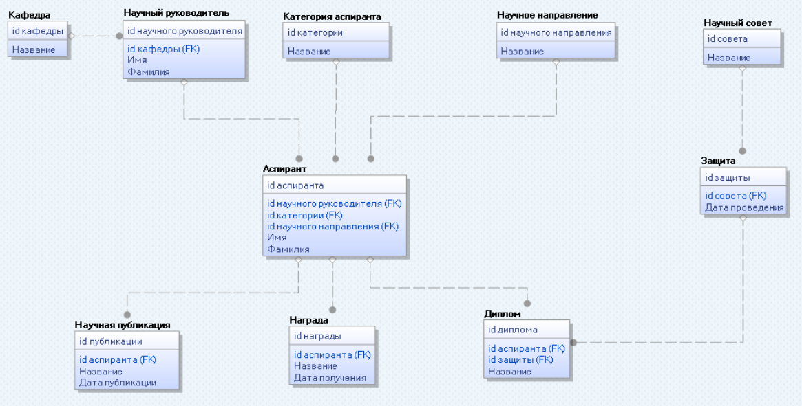

# Разработка БД для отдела аспирантуры ВУЗа.

### Предметная область: *отдел аспирантуры ВУЗа*.

БД должна поддерживать выполнение следующих функций:

* учет сведений об аспирантах ВУЗа различных категорий (очные, заочные, соискатели, докторанты);
* формирование списка аспирантов по кафедрам и по научным руководителям; изменение данных об аспирантах (научный
  руководитель, научное направление, персональные данные, дипломы, награды);
* учет научных публикаций аспирантов;
* учет научных публикаций научного руководителя аспиранта;
* учет работы научных советов; составление отчетов о состоявшихся защитах (по различным категориям, научным
  направлениям, кафедрам, научным руководителям и т.п.)

## Реализовать UI для:

* Аспирант
* ~~Категория аспиранта~~
* ~~Кафедра~~
* Научный руководитель
* Диплом
* Награда
* Научное направление
* Научная публикация
* Научный совет
* Защита